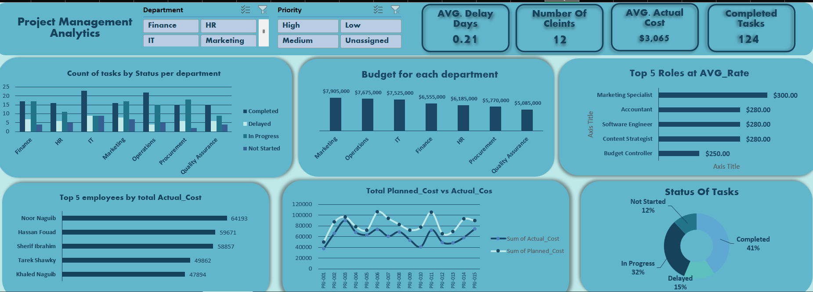

## Project Title

# 📊 Project Management Analytics Dashboard

### Excel | Power Query | PivotTables | Power Pivot | DAX

---

## Overview

This project demonstrates a complete **Project Management Analytics solution** built entirely in Microsoft Excel.

The objective was to transform messy project tracking data into an interactive dashboard by applying modern Excel data analytics techniques.

The project simulates the work of a Data Analyst supporting a **Project Management Office (PMO)** responsible for monitoring multiple projects simultaneously.

---

## Business Problem

The PMO receives project task exports from a legacy tracking system.

The raw data contains:

* Duplicate records
* Placeholder rows
* Inconsistent text formatting
* Mixed date formats
* Missing values
* Different naming conventions

Before any analysis can be performed, the data must be cleaned, standardized, modeled, and visualized.

---

## Project Workflow

```text
Raw Data
      │
      ▼
Power Query
(Data Cleaning)
      │
      ▼
Excel Functions
      │
      ▼
PivotTables
      │
      ▼
Power Pivot
(Data Model + DAX)
      │
      ▼
Interactive Dashboard
```

---

# Tools Used

| Tool             | Purpose               |
| ---------------- | --------------------- |
| Microsoft Excel  | Main Analysis         |
| Power Query      | Data Cleaning & ETL   |
| Excel Functions  | Business Calculations |
| PivotTables      | Data Aggregation      |
| Power Pivot      | Data Modeling         |
| DAX              | KPI Measures          |
| Charts & Slicers | Dashboard             |

---

# Data Cleaning (Power Query)

The raw dataset was cleaned using Power Query.

### Cleaning Steps

✔ Removed duplicate records

✔ Removed placeholder rows

✔ Trimmed & cleaned text fields

✔ Standardized:

* Department
* Status
* Priority

✔ Converted dates

✔ Replaced missing values

✔ Added calculated columns

* Planned Duration
* Delay Days

✔ Merged Projects table

✔ Merged Employees table

✔ Assigned correct data types

---

# Excel Functions

The cleaned dataset includes additional calculated columns.

### Cost Analysis

* Cost Variance
* Cost Variance %

### Performance

* On-Time Flag

### Duration

* Task Age Category

### Lookup

* INDEX/MATCH

### Summary Metrics

* COUNTIFS
* SUMIFS
* AVERAGEIFS
* TEXT
* DATEDIF

---

# PivotTable Analysis

The project contains multiple PivotTables including:

* Planned vs Actual Cost by Project
* Tasks by Department & Status
* Average Delay by Department
* Top 5 Employees by Actual Cost

Interactive slicers allow quick filtering.

---

# Power Pivot Data Model

Relationships were created between:

Tasks

↓

Projects

↓

Employees

DAX Measures include:


---

# Dashboard

The final dashboard includes:

### KPI Cards

* Total Planned Cost

* Total Actual Cost

* Cost Variance %

* On-Time Completion Rate

### Charts

* Planned vs Actual Cost

* Tasks by Status

* Average Delay

### Interactive Filters

* Department

* Priority

---

# Dashboard Preview


```

```

---


# Skills Demonstrated

* Data Cleaning
* ETL
* Excel Functions
* Power Query
* PivotTables
* Power Pivot
* DAX
* Dashboard Design
* Business Analytics
* Data Modeling

---

# Key Learning Outcomes

* Building an end-to-end analytics solution using Excel.
* Designing a relational data model.
* Creating reusable DAX measures.
* Developing interactive dashboards for business decision-making.
* Applying best practices in data cleaning and reporting.

---

# Author

**Ahmed Sherif**

Data Analyst

